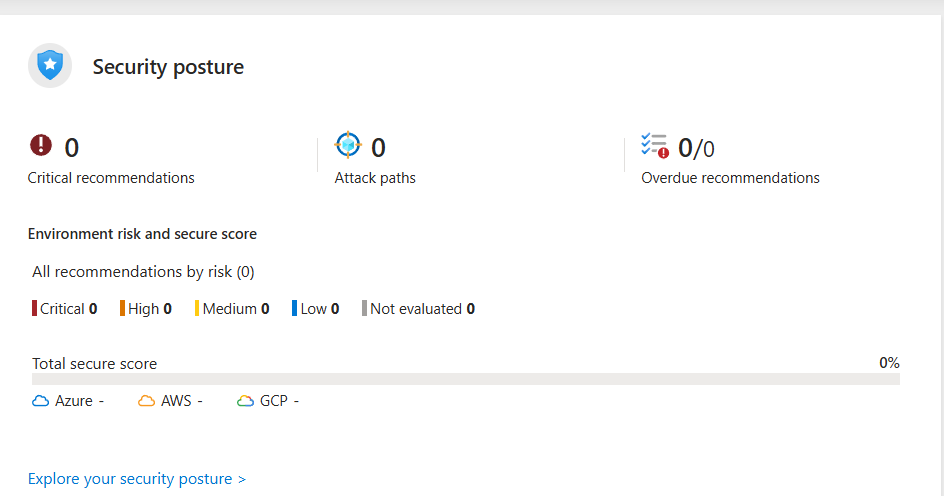
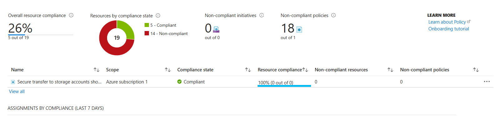
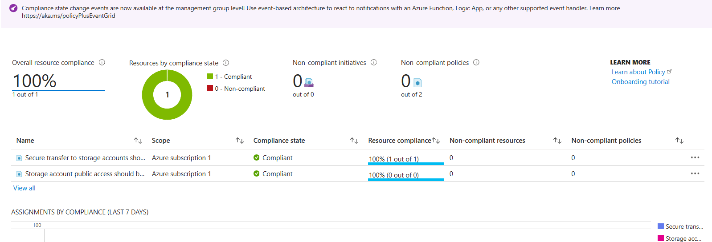

⚠️ Educational use only. Test on devices/networks you own or have explicit permission to assess. Comply with local laws.

# 🌐 Azure Governance & Compliance Lab

## 🧭 Overview

This project demonstrates the implementation of **Azure governance and compliance controls** within a cloud environment aligned to **NIST CSF 2.0** and **Microsoft Cloud Security Benchmark** standards.  
It showcases my ability to **configure, monitor, and enforce Azure Policy**, apply **role-based access control (RBAC)**, and strengthen an organization’s **cloud security posture** using native Microsoft security tools.

---

## 🧰 Tools & Services Used

- **Microsoft Azure Portal**
- **Microsoft Defender for Cloud**
- **Azure Policy**
- **Azure Resource Manager (ARM)**
- **Azure Role-Based Access Control (RBAC)**
- **NIST CSF v2.0** & **NIST SP 800-53 Rev.5** compliance frameworks

---

## ⚙️ Project Objectives

1. Implement foundational **security and compliance baselines** in Azure.
2. Enforce **data protection controls** through built-in and custom Azure Policies.
3. Apply **least-privilege access** using Azure RBAC.
4. Assess and remediate non-compliant resources.
5. Evaluate overall **Secure Score** and compliance posture.

---

## 🧩 Steps Performed

### 1️⃣ Configure Microsoft Defender for Cloud

- Enabled Defender for Cloud to monitor resource compliance.
- Selected **Microsoft Cloud Security Benchmark** and **NIST CSF 2.0** as compliance frameworks.
- Assigned standards at the management group and subscription levels.

### 2️⃣ Assign and Enforce Azure Policies

- **Enabled HTTPS-only secure transfer** for all storage accounts.
- **Disabled public access** to storage accounts.
- Verified compliance results under _Azure Policy → Compliance_.

### 3️⃣ Apply Role-Based Access Control (RBAC)

- Created role assignments simulating least-privilege access:
  - “Storage Blob Data Reader” (Alice Cobb)
  - “Reader” (Jim Vessel)
- Validated assignments through Access Control (IAM).

### 4️⃣ Review Policy Compliance & Secure Score

- Confirmed compliance status at **100%** for assigned storage account policies.
- Monitored NIST framework evaluation (805 controls assessed).
- Verified secure score in Microsoft Defender for Cloud dashboard.

### 5️⃣ Export and Document Compliance Results

- Exported compliance report (`.csv`) for audit trail and documentation.
- Captured screenshots for visual verification.

---

## 📸 Screenshots

# Defender for Cloud Overview

# Security Policies

# Policy Compliance Dashboard BEFORE & AFTER Implementation

# MFA + Security Defaults Enabled

---

## 🧾 Reports

/Reports/ComplianceListExport.csv

---

## 🧠 Key Learning Outcomes

- Strengthened understanding of **Azure governance and compliance frameworks**.
- Gained hands-on experience implementing **NIST-aligned policies** in cloud environments.
- Learned to analyze and remediate **non-compliant Azure resources**.
- Practiced enforcing **least privilege access** via RBAC.
- Built a baseline for **multi-cloud security governance** (Azure + M365).

---

## 🚀 Next Steps

- Enable **Log Analytics Workspace** and integrate Defender for Cloud alerts.
- Create custom **Azure Monitor Dashboards** to visualize compliance metrics.
- Extend policy coverage to **network security**, **resource tagging**, and **cost governance**.

---

## 🏷️ Tags

`Azure Policy` `Microsoft Defender for Cloud` `NIST CSF` `Cloud Security` `Governance` `RBAC` `Compliance` `Azure Administration`
